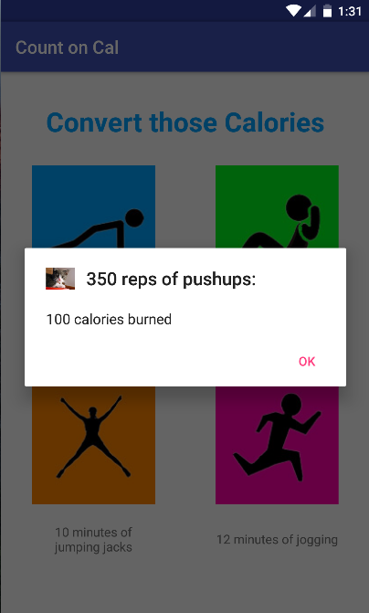

# PROG 01: Crunch Time

I created a simple and easy to use calorie converting app. I wanted to show the user everything that he needed to know with the click of one button. After only inputting 2 pieces of information, the user can view how many calories were burned, and a list of the equivalent conversions for other exercises. 

The app works as such:
1. app opens on the main page where user is able to input the specific exercise and reps/minutes. 

2. user presses enter after inputting reps/minutes and is immediately taken to an alert screen that tells the user how many calories were burned based on the inputs.

3. user may press ‘ok’ and view the equivalent conversions for all other exercises.

## Authors

Fayyaz Mukarram ([mfayyaz@berkeley.edu](mailto:mfayyaz@berkeley.edu))

## Demo Video

See [your demo video title here] (https://link_to_your_video)

## Screenshots

## Acknowledgments

A big thank you to all Android Studio tutorials on the internet because I’m pretty sure I watched every single one possible. Shout out to Stack Overflow for always coming in clutch. 

